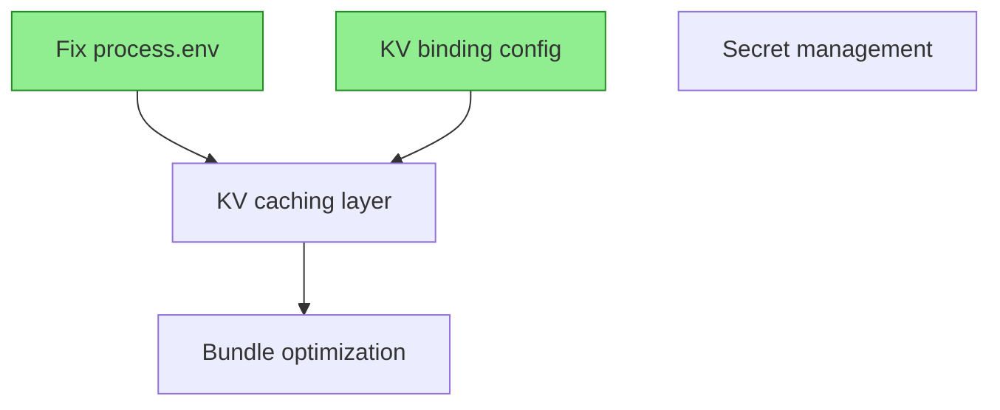

# Beads Status Command

## Introduction

This command displays the current state of your Beads issues with intelligent grouping, ready-work detection, and dependency visualization. It helps you understand what work can be started now, what's blocked, and what's currently in progress across the 27 edge-stack agents.

## Prerequisites

- Beads initialized (`/es-beads-init` completed)
- Either:
  - Beads CLI (`bd`) installed
  - OR Beads MCP server enabled

## Status Display Workflow

### Step 1: Check Beads Availability

```bash
# Verify Beads is initialized
if [ ! -d ".beads" ]; then
  echo "❌ Beads not initialized"
  echo ""
  echo "To initialize Beads:"
  echo "  /es-beads-init"
  exit 1
fi

# Verify bd command or MCP server available
if ! command -v bd &> /dev/null; then
  echo "⚠️  Beads CLI (bd) not found"
  echo "   Make sure Beads MCP server is enabled or install bd CLI"
  exit 1
fi
```

### Step 2: Fetch All Issues

Get all Beads issues in JSON format for processing:

```bash
# Fetch all issues
all_issues=$(bd list --format json)
total_count=$(echo "$all_issues" | jq length)

if [ "$total_count" -eq 0 ]; then
  echo "📊 Beads Status (0 issues)"
  echo ""
  echo "✨ No issues yet. Create your first issue:"
  echo "   /es-beads-create \"Your first task\""
  echo "   or"
  echo "   /es-review (choose BEADS option)"
  exit 0
fi
```

### Step 3: Categorize Issues by Status

Group issues into categories:

```bash
# Extract issues by status
ready_work=$(echo "$all_issues" | jq '[.[] | select(.blocked_by == [] or .blocked_by == null) | select(.status != "closed") | select(.locked_by == null or .locked_by == "")]')
blocked=$(echo "$all_issues" | jq '[.[] | select(.blocked_by != [] and .blocked_by != null) | select(.status != "closed")]')
in_progress=$(echo "$all_issues" | jq '[.[] | select(.locked_by != null and .locked_by != "") | select(.status != "closed")]')
open_other=$(echo "$all_issues" | jq '[.[] | select(.blocked_by == [] or .blocked_by == null) | select(.status != "closed") | select(.locked_by == null or .locked_by == "") | select(.status == "open")]')
closed=$(echo "$all_issues" | jq '[.[] | select(.status == "closed")]')

# Count each category
ready_count=$(echo "$ready_work" | jq length)
blocked_count=$(echo "$blocked" | jq length)
in_progress_count=$(echo "$in_progress" | jq length)
open_count=$(echo "$open_other" | jq length)
closed_count=$(echo "$closed" | jq length)
```

### Step 4: Display Status Header

```markdown
📊 Beads Status ($total_count total issues)

Progress: $closed_count/$total_count completed (X%)
```

### Step 5: Display Ready Work (Priority Section)

Ready work = issues with no blockers, not locked, not closed:

```bash
if [ "$ready_count" -gt 0 ]; then
  echo ""
  echo "✅ READY WORK ($ready_count issues - can start now):"
  echo ""

  # Display each ready issue
  echo "$ready_work" | jq -r '.[] |
    "  \(.id) [\(.priority // "P2")] \(.title)" +
    (if .assigned_agent then " (→ \(.assigned_agent))" else "" end) +
    (if .tags then "\n    Tags: \(.tags | join(", "))" else "" end) +
    (if .location then "\n    Location: \(.location)" else "" end)'

  echo ""
  echo "Next: /es-work <issue-id>"
else
  echo ""
  echo "⏸️  No ready work (all issues are blocked or in progress)"
fi
```

**Example output:**
```
✅ READY WORK (8 issues - can start now):

  bd-a1b2 [P1] Fix process.env usage in Workers runtime (→ workers-runtime-guardian)
    Tags: workers-runtime, security, code-review
    Location: src/index.ts:42

  bd-c3d4 [P2] Add Durable Object hibernation pattern (→ durable-objects-architect)
    Tags: durable-objects, performance
    Location: src/storage.ts

  bd-g7h8 [P2] Optimize cold start bundle size (→ edge-performance-oracle)
    Tags: performance, optimization
```

### Step 6: Display Blocked Issues

Issues waiting on dependencies:

```bash
if [ "$blocked_count" -gt 0 ]; then
  echo ""
  echo "⏸️  BLOCKED ($blocked_count issues - waiting on dependencies):"
  echo ""

  # Display each blocked issue with its blockers
  echo "$blocked" | jq -r '.[] |
    "  \(.id) [\(.priority // "P2")] \(.title)" +
    (if .blocked_by then "\n    ↳ Blocked by: \(.blocked_by | join(", "))" else "" end) +
    (if .assigned_agent then "\n    ↳ Assigned: \(.assigned_agent)" else "" end)'

  echo ""
fi
```

**Example output:**
```
⏸️  BLOCKED (12 issues - waiting on dependencies):

  bd-e5f6 [P1] Migrate to new binding pattern
    ↳ Blocked by: bd-a1b2, bd-c3d4
    ↳ Assigned: binding-context-analyzer

  bd-j9k0 [P2] Implement KV caching layer
    ↳ Blocked by: bd-e5f6
```

### Step 7: Display In-Progress Issues

Issues currently being worked on (locked by agents):

```bash
if [ "$in_progress_count" -gt 0 ]; then
  echo ""
  echo "🔄 IN PROGRESS ($in_progress_count issues):"
  echo ""

  # Display each in-progress issue
  echo "$in_progress" | jq -r '.[] |
    "  \(.id) [\(.priority // "P2")] \(.title)" +
    (if .locked_by then "\n    ↳ Working: \(.locked_by)" else "" end) +
    (if .locked_at then "\n    ↳ Started: \(.locked_at)" else "" end) +
    (if .lock_expires then "\n    ↳ Expires: \(.lock_expires)" else "" end)'

  echo ""
fi
```

**Example output:**
```
🔄 IN PROGRESS (3 issues):

  bd-m4n5 [P1] Refactor Workers runtime checks
    ↳ Working: workers-runtime-guardian
    ↳ Started: 2025-12-09T14:30:00Z
    ↳ Expires: 2025-12-09T15:30:00Z
```

### Step 8: Display Open (Untriaged) Issues

Issues that are open but not categorized:

```bash
if [ "$open_count" -gt 0 ]; then
  echo ""
  echo "📋 OPEN ($open_count issues - needs triage or assignment):"
  echo ""

  echo "$open_other" | jq -r '.[] |
    "  \(.id) [\(.priority // "P2")] \(.title)" +
    (if .tags then "\n    Tags: \(.tags | join(", "))" else "" end)'

  echo ""
fi
```

### Step 9: Display Recent Activity

Show recently closed issues (last 7 days):

```bash
# Get issues closed in last 7 days
seven_days_ago=$(date -Iseconds -d '7 days ago' 2>/dev/null || date -u -Iseconds -v -7d)
recent_closed=$(echo "$closed" | jq --arg since "$seven_days_ago" '[.[] | select(.closed_at > $since)]')
recent_count=$(echo "$recent_closed" | jq length)

if [ "$recent_count" -gt 0 ]; then
  echo ""
  echo "🎉 Recently Closed (last 7 days - $recent_count issues):"
  echo ""

  echo "$recent_closed" | jq -r '.[] |
    "  ✓ \(.id): \(.title)" +
    (if .closed_at then " (closed \(.closed_at))" else "" end)'

  echo ""

  # Check if any issues were unblocked
  # Find issues that were blocked by recently closed issues
  unblocked_ids=$(echo "$recent_closed" | jq -r '.[].id')
  for closed_id in $unblocked_ids; do
    unblocked=$(echo "$all_issues" | jq --arg id "$closed_id" '[.[] | select(.blocked_by // [] | contains([$id]))]')
    unblocked_count=$(echo "$unblocked" | jq length)

    if [ "$unblocked_count" -gt 0 ]; then
      echo "  ↳ Unblocked $unblocked_count issue(s) by closing $closed_id"
    fi
  done
fi
```

### Step 10: Dependency Tree Visualization (Optional)

If user has many issues with complex dependencies, offer to show dependency graph:

```bash
if [ "$total_count" -gt 10 ]; then
  echo ""
  echo "📊 Show dependency tree? (y/n)"
  read -r show_tree

  if [ "$show_tree" = "y" ]; then
    # Generate mermaid diagram of dependencies
    generate_dependency_tree
  fi
fi
```

### Dependency Tree Generation

```bash
generate_dependency_tree() {
  echo ""
  echo "Dependency Tree:"
  echo '```mermaid'
  echo 'graph TD'

  # Add all issues as nodes
  echo "$all_issues" | jq -r '.[] |
    "  \(.id)[\(.title)]" +
    (if .status == "closed" then ":::closed" else "" end)'

  # Add dependency edges
  echo "$all_issues" | jq -r '.[] |
    select(.blocked_by != null and .blocked_by != []) |
    .blocked_by[] as $blocker |
    "  \($blocker) --> \(.id)"'

  # Style closed nodes
  echo '  classDef closed fill:#90EE90,stroke:#228B22'

  echo '```'
  echo ""
}
```

**Example mermaid output:**


### Step 11: Priority Distribution

Show breakdown by priority:

```bash
p1_count=$(echo "$all_issues" | jq '[.[] | select(.priority == "p1" or .priority == "P1")] | length')
p2_count=$(echo "$all_issues" | jq '[.[] | select(.priority == "p2" or .priority == "P2")] | length')
p3_count=$(echo "$all_issues" | jq '[.[] | select(.priority == "p3" or .priority == "P3")] | length')
no_priority=$(echo "$all_issues" | jq '[.[] | select(.priority == null or .priority == "")] | length')

echo ""
echo "Priority Distribution:"
echo "  🔴 P1 (Critical): $p1_count"
echo "  🟡 P2 (Important): $p2_count"
echo "  🔵 P3 (Nice-to-have): $p3_count"
if [ "$no_priority" -gt 0 ]; then
  echo "  ⚪ No priority: $no_priority"
fi
```

### Step 12: Tag Analysis (Top Tags)

Show most common tags:

```bash
echo ""
echo "Top Tags:"
echo "$all_issues" | jq -r '[.[].tags // [] | .[]] | group_by(.) |
  map({tag: .[0], count: length}) |
  sort_by(.count) |
  reverse |
  .[0:5] |
  .[] |
  "  \(.tag): \(.count) issues"'
```

**Example output:**
```
Top Tags:
  workers-runtime: 15 issues
  security: 12 issues
  performance: 10 issues
  durable-objects: 8 issues
  kv: 6 issues
```

### Step 13: Next Actions

Provide actionable next steps:

```bash
echo ""
echo "Next Actions:"

if [ "$ready_count" -gt 0 ]; then
  # Get first ready P1 issue
  first_ready=$(echo "$ready_work" | jq -r '[.[] | select(.priority == "p1" or .priority == "P1")] | .[0].id // empty')

  if [ -n "$first_ready" ]; then
    echo "  1. Start highest priority ready work:"
    echo "     /es-work $first_ready"
  else
    # Get first ready issue (any priority)
    first_ready=$(echo "$ready_work" | jq -r '.[0].id')
    echo "  1. Start ready work:"
    echo "     /es-work $first_ready"
  fi
fi

if [ "$blocked_count" -gt 0 ]; then
  echo "  2. Unblock issues by completing blockers (see BLOCKED section)"
fi

if [ "$total_count" -eq 0 ]; then
  echo "  1. Create issues from code review:"
  echo "     /es-review"
  echo "  2. Or create manually:"
  echo "     /es-beads-create \"description\""
fi

echo "  3. View dependency tree:"
echo "     /es-beads-status (and choose 'y' for tree)"
```

## Advanced Features

### Filter by Tag

Allow filtering status by tag:

```bash
# Usage: /es-beads-status #workers-runtime
tag_filter="#$ARGUMENTS"

if [ -n "$tag_filter" ]; then
  echo "Filtering by tag: $tag_filter"
  filtered=$(echo "$all_issues" | jq --arg tag "${tag_filter#\#}" '[.[] | select(.tags // [] | contains([$tag]))]')
  # Re-run categorization on filtered issues
fi
```

### Filter by Priority

```bash
# Usage: /es-beads-status p1
priority_filter="$ARGUMENTS"

if [[ "$priority_filter" =~ ^p[123]$ ]]; then
  echo "Filtering by priority: $priority_filter"
  filtered=$(echo "$all_issues" | jq --arg pri "$priority_filter" '[.[] | select(.priority == $pri or .priority == ($pri | ascii_upcase))]')
fi
```

### Show Only Ready Work

```bash
# Usage: /es-beads-status --ready-only
if [ "$ARGUMENTS" = "--ready-only" ]; then
  echo "Showing ready work only..."
  # Display only ready work section
fi
```

## Error Handling

### Beads Not Initialized

```bash
if [ ! -d ".beads" ]; then
  echo "❌ Beads not initialized in this project"
  echo ""
  echo "To initialize Beads:"
  echo "  /es-beads-init"
  echo ""
  echo "Or use TodoWrite for single-session tracking"
  exit 1
fi
```

### No Issues

```bash
if [ "$total_count" -eq 0 ]; then
  echo "📊 Beads Status (0 issues)"
  echo ""
  echo "✨ No issues yet! Get started:"
  echo ""
  echo "1. Run code review and create issues:"
  echo "   /es-review (choose BEADS option)"
  echo ""
  echo "2. Create issue manually:"
  echo "   /es-beads-create \"Your task description\""
  echo ""
  echo "3. Import from GitHub:"
  echo "   /es-beads-import <issue-number>"
  exit 0
fi
```

### bd Command Not Found

```bash
if ! command -v bd &> /dev/null; then
  echo "❌ Beads CLI (bd) not found"
  echo ""
  echo "Options:"
  echo "1. Install Beads CLI: cargo install beads-cli"
  echo "2. Enable Beads MCP server (if available)"
  echo "3. Re-run /es-beads-init for setup"
  exit 1
fi
```

## Notes

- **Real-time updates:** Status reflects current state of `.beads/issues.jsonl`
- **Git-synced:** Pull latest changes to see updates from other sessions/machines
- **Ready work detection:** Only shows issues with no blockers and not locked
- **Agent coordination:** Locked issues show which agent is working on them
- **Dependency tracking:** Blocked issues show what they're waiting for
- **Multi-agent visibility:** See work distribution across 27 edge-stack agents
