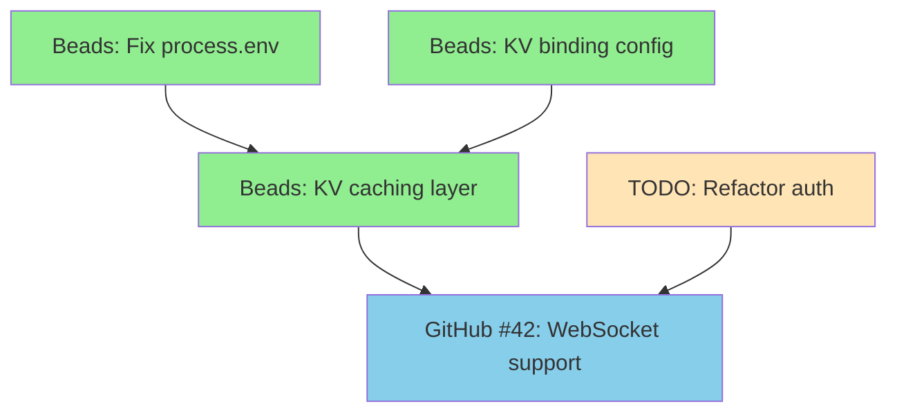

Resolve all TODO files and GitHub issues using parallel processing.

## Workflow

### 1. Analyze

Get all unresolved items from multiple sources:

**Beads Issues:**
- Get all open Beads issues via `bd list --status open --format json`
- Extract ready work (no blockers) and blocked work
- Parse dependencies for execution graph

**TODO Files:**
- Get all unresolved TODOs from the `/todos/*.md` directory

**GitHub Issues:**
- Fetch open GitHub issues via `gh issue list --json number,title,labels,body,url`
- Parse and extract actionable items from issues

### 2. Plan

Create a TodoWrite list of all unresolved items grouped by source (Beads, TODO files, GitHub issues) and type.

**Dependency Analysis:**

1. **Beads Dependencies** (Native):
   - Beads issues have explicit dependencies (`blocked_by`, `depends_on`)
   - Use `bd list --format json` to get dependency graph
   - Ready work = issues with no blockers

2. **TODO File Dependencies**:
   - Check frontmatter for `dependencies: [issue_id]`
   - Manual dependency detection (e.g., "Fix binding" blocks "Use binding")

3. **GitHub Dependencies**:
   - Check issue body for "Depends on #42" or "Blocked by #123"
   - Extract references from issue description

4. **Cross-Source Dependencies**:
   - Beads issues may reference GitHub issues (via `github_number` metadata)
   - TODO files may reference Beads issues (e.g., "After bd-a1b2")
   - Build unified dependency graph across all sources

**Visualization:**

Output a mermaid flow diagram showing the unified resolution flow:



**Execution Waves:**
- Wave 1: bd-a1b2, bd-c3d4, todo-042 (no blockers - parallel)
- Wave 2: bd-e5f6 (after wave 1 completes)
- Wave 3: gh-42 (after wave 2 completes)

### 3. Implement (PARALLEL with Dependency-Aware Waves)

Spawn appropriate agents for each unresolved item in dependency-aware waves:

**Step 3a: Build Unified Dependency Graph**

```bash
# Fetch all sources
beads_issues=$(bd list --status open --format json)
todo_files=$(ls todos/*-pending-*.md 2>/dev/null)
github_issues=$(gh issue list --json number,title,body --jq '.[]')

# Build dependency map
declare -A dependencies
declare -A wave_assignment

# Add Beads dependencies
echo "$beads_issues" | jq -c '.[]' | while read -r issue; do
  id=$(echo "$issue" | jq -r '.id')
  blocked_by=$(echo "$issue" | jq -r '.blocked_by // [] | .[]')

  if [ -n "$blocked_by" ]; then
    dependencies["$id"]="$blocked_by"
  fi
done

# Add TODO dependencies (from frontmatter)
for todo_file in $todo_files; do
  deps=$(grep -E '^dependencies:' "$todo_file" | sed 's/dependencies: *//')
  if [ -n "$deps" ]; then
    todo_id=$(basename "$todo_file" | grep -oE '^[0-9]+')
    dependencies["todo-$todo_id"]="$deps"
  fi
done

# Calculate execution waves using topological sort
# Wave 1: Items with no dependencies
# Wave 2: Items depending only on Wave 1
# Wave 3: Items depending on Wave 1 or 2
# etc.
```

**Step 3b: Execute by Wave**

**Wave 1** (No blockers - maximum parallelism):

```bash
# Beads ready work
ready_beads=$(echo "$beads_issues" | jq -r '[.[] | select(.blocked_by == [] or .blocked_by == null)] | .[].id')

# TODO files with no dependencies
ready_todos=$(for f in $todo_files; do
  if ! grep -q '^dependencies:' "$f"; then
    basename "$f" | grep -oE '^[0-9]+'
  fi
done)

# GitHub issues with no "depends on" in body
ready_github=$(echo "$github_issues" | jq -r '[.[] | select(.body | test("(?i)(depends on|blocked by)") | not)] | .[].number')

# Spawn agents in parallel for Wave 1
echo "🚀 Wave 1: $(echo "$ready_beads $ready_todos $ready_github" | wc -w) items (parallel)"

# Beads issues: Use /es-work
for beads_id in $ready_beads; do
  Task general-purpose("/es-work $beads_id")
done

# TODO files: Use pr-comment-resolver
for todo_id in $ready_todos; do
  todo_file=$(ls todos/${todo_id}-*.md)
  Task pr-comment-resolver("$todo_file")
done

# GitHub issues: Use general-purpose
for gh_num in $ready_github; do
  Task general-purpose("Resolve GitHub issue #$gh_num")
done

# Wait for Wave 1 to complete
echo "⏳ Waiting for Wave 1 to complete..."
# (Agents run in parallel, wait for all to finish)
```

**Wave 2** (After Wave 1 completes):

```bash
# Find items now unblocked by Wave 1 completion
wave2_beads=$(echo "$beads_issues" | jq --argjson wave1 "$(echo $ready_beads | jq -R 'split(" ")')" -r '
  [.[] | select(.blocked_by != null and .blocked_by != []) |
   select(all(.blocked_by[]; . as $dep | $wave1 | index($dep) != null))] |
  .[].id
')

wave2_todos=$(...)  # Similar logic for TODOs
wave2_github=$(...)  # Similar logic for GitHub

echo "🚀 Wave 2: $(echo "$wave2_beads $wave2_todos $wave2_github" | wc -w) items (parallel)"

# Spawn Wave 2 agents
# (Same pattern as Wave 1)
```

**Continue until all waves complete**

**Example Execution:**

If there are:
- 3 Beads issues: bd-a1b2 (ready), bd-c3d4 (ready), bd-e5f6 (blocked by bd-a1b2, bd-c3d4)
- 2 TODO items: todo-042 (ready), todo-043 (blocked by todo-042)
- 1 GitHub issue: gh-42 (blocked by bd-e5f6)

**Execution plan:**
```
Wave 1 (parallel - 3 items):
  Task general-purpose("/es-work bd-a1b2")
  Task general-purpose("/es-work bd-c3d4")
  Task pr-comment-resolver(todos/042-*.md)

Wave 2 (after Wave 1 - 2 items):
  Task general-purpose("/es-work bd-e5f6")
  Task pr-comment-resolver(todos/043-*.md)

Wave 3 (after Wave 2 - 1 item):
  Task general-purpose("Resolve GitHub issue #42")
```

**Advantages:**
- ✅ Maximum parallelism (run independent items together)
- ✅ Respects dependencies (never start blocked work)
- ✅ Unified across sources (Beads, TODOs, GitHub)
- ✅ Auto-unblocking (Beads issues auto-unblock when dependencies close)

### 4. Commit & Resolve

**For Beads issues:**
- Automatically closed by `/es-work` when complete
- Dependencies auto-unblock via Beads mechanism
- No manual cleanup needed

**For TODO files:**
- Remove the TODO from the file and mark it as resolved
- If TODO was created from Beads issue, that Beads issue already closed

**For GitHub issues:**
- Close the issue via `gh issue close <number> --comment "Resolved in commit <sha>"`
- If GitHub issue linked to Beads, run `/es-beads-sync` to update
- Reference the commit that resolves the issue

**Final steps:**
- Commit all changes with descriptive message
- Push to remote repository
- Run `/es-beads-sync` to synchronize Beads ↔ GitHub states

**Post-Resolution Status:**
```bash
# Show final status
echo ""
echo "━━━━━━━━━━━━━━━━━━━━━━━━━━━━━━━━━━━━━━━━"
echo "📊 Resolution Summary"
echo "━━━━━━━━━━━━━━━━━━━━━━━━━━━━━━━━━━━━━━━━"
echo ""
echo "Beads Issues:"
echo "  Resolved: X issues"
echo "  Remaining: Y open issues"
echo "  Next ready: /es-beads-status"
echo ""
echo "TODO Files:"
echo "  Resolved: X files"
echo "  Remaining: Y pending files"
echo ""
echo "GitHub Issues:"
echo "  Closed: X issues"
echo "  Remaining: Y open issues"
echo ""
echo "Next: /es-beads-status to see newly unblocked work"
```
